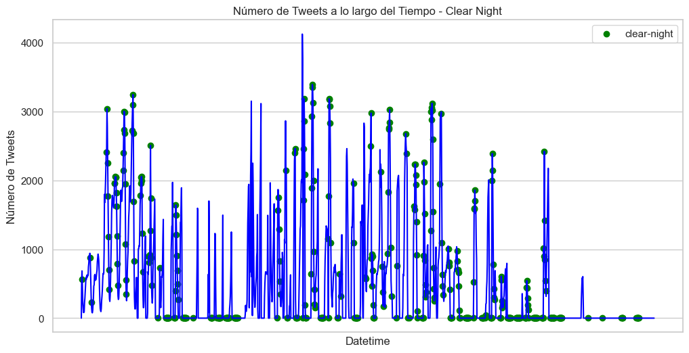
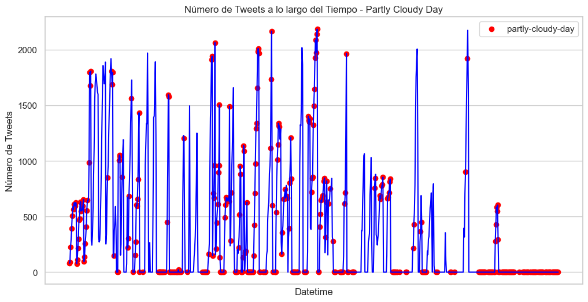
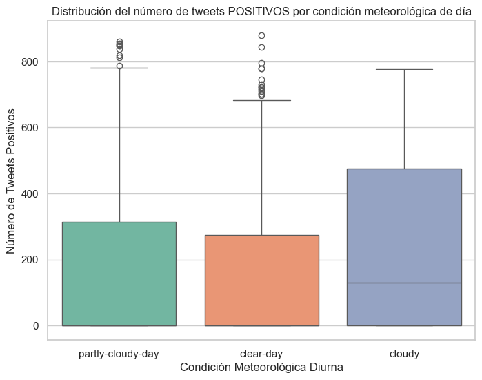
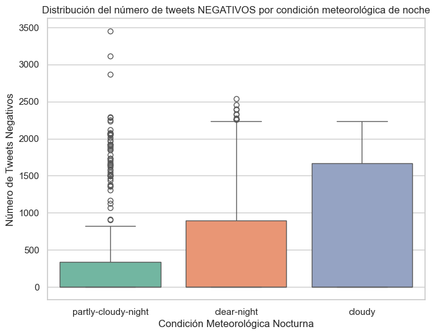
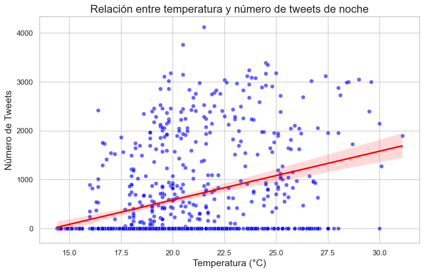
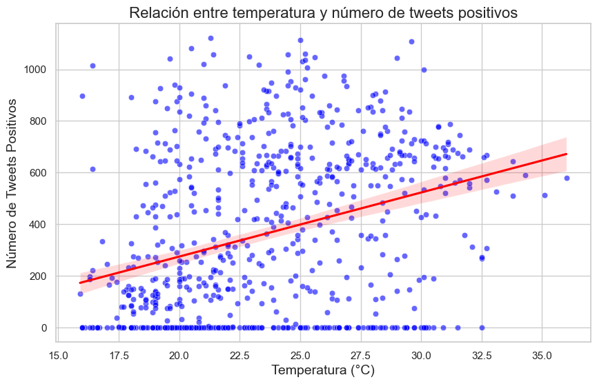

# 1. Interpretación

## 1.1. Análisis de Patrones Descubiertos

En el análisis general se observa que hay un mayor número de tweets durante la noche que por el día, coincidiendo con la medianoche cuando más y las horas de menos con la madrugada, lo que puede indicar que se publican más tweets debido al aumento del uso del móvil por las noches cuando la gente se va a dormir, aunque no es concluyente.

Luego se hace un estudio del número de tweets distinguiendo de día y noche para ver si hay una diferencia entre que el cielo esté nublado y soleado. Observamos que ambos tienen picos de más de 3000 tweets, pero cuando el cielo está nublado hay muchos más picos que cuando está soleado. Esto puede indicar que si el cielo está nublado la gente se quede en casa y se publiquen más tweets, pero no se asegura que por estar nublado vaya a haber un gran número de tweets, aunque puede indicar que sea más probable que se publiquen más tweets.

Después, se utiliza ANOVA para ver si hay una diferencia entre el estado del cielo y el número de tweets. Se observa que durante el día da igual el estado del cielo, pero de noche indica que sí hay diferencias entre los estados del cielo, apoyando la hipótesis de que cuando el cielo está nublado de noche se publican más tweets. 
Por otro lado, se diferencian tweets etiquetados como negativos de los positivos durante la noche y el día para ver si el tiempo influye en el sentimiento, pero no se obtienen resultados favorables, simplemente se observa que influye en la cantidad de tweets, pero no se diferencia en tweets negativos o positivos. Lo único que se apoya es la hipótesis de que hay mayor actividad en la noche cuando el cielo está nublado.

También, se intenta estudiar la relación entre la temperatura y número de tweets, así como su sentimiento asociado. No se observa una correlación concluyente entre la temperatura y el número de tweets. Sin embargo, con los tweets positivos y la temperatura se obtiene una correlación moderada, mientras que no hay correlación con los tweets negativos. 
La correlación no es demasiado alta, e incluso si los resultados hubieran sido altos, es importante destacar que este análisis no es concluyente, estas correlaciones no implican causalidad.

También, se hace un estudio de los temas de los tweets. 
Primero, se analizan si los temas varían mucho dependiendo de si se publican por la noche o por el día. Se encuentran algunos resultados interesantes. Por ejemplo, en la noche destacan topics como el amor, la vida, hacer ahora o dormir, lo cual tiene sentido y nos puede indicar que durante la noche las personas son más reflexivas, hablando de temas más específicos como indica su perplexity bajo. En cambio, durante el día se observan topics como tener buen día, quedar en casa, la gente y la vida presente, temas más generales y comunes, que se refleja en un valor alto de log likelihood y perplexity.
Después, se realiza un modelo dinámico de tópicos por mes, para ver cómo evolucionan los temas a lo largo de los 3 meses en los que se encuentran nuestros datos. Por desgracia, no se observa ninguna evolución respecto a los temas de los tweets. Vemos que tanto en los dos modelos que desarrollamos los temas que predominan en cada mes son prácticamente iguales, indicando que no depende del mes, sino que son temas recurrentes en los tweets sin importar el tiempo.

En un último análisis se muestra el impacto de las variables exógenas sobre la serie temporal del número de tweets. La distinción entre día y noche no parece influir en el comportamiento del número de tweets, como lo refleja un p-valor alto de 0.530. Sin embargo, la variable correspondiente al día de la semana tiene un p-valor de 0.000, lo que indicaría una fuerte influencia en la serie. Este resultado sugiere que existen patrones consistentes de actividad según el día, posiblemente relacionados con diferencias en el comportamiento de los usuarios a lo largo de la semana, como fines de semana más tranquilos o picos de actividad en días laborales.

## 1.2. Relación con las Preguntas de Investigación

Las preguntas fueron:

""Los días de temperaturas más extremas se publican más tweets que en días de clima moderado." **La correlación entre temperatura y número de tweets es positiva pero moderada. Se separaron los datos entre datos de día y noche y se utilizaron las métricas de Pearson y Spearman. Tanto de día como de noche las correlaciones son significativas pero aún son moderadas como para destacarlas.**

"En dias lluviosos o nublados, la cantidad de tweets con sentimiento negativo es mayor que en días soleados."**Al final no tuvimos datos de lluvia, pero hablando de lo nublado efectivamente hay más datos de tweets en horas nubladas que horas soleadas. Para confirmarlo de manera estadística tenemos un resultado  del anova menor que 0.05 lo que indica que hay una diferencia estadísticamente significativa en el número de tweets negativos entre las diferentes condiciones meteorológicas**

"La lluvia y las bajas temperaturas están asociadas con un aumento en el número total de tweets."**Otra ves por lluvia no pudo ser contestado pero en cuanto a bajas temperaturas se repite la respuesta con el mismo análisis de correlación, que de hecho en su moderada correlación indica que sería incluso al revés, a menor temperatura, menor número de tweets.**

"El clima soleado está asociado con un aumento en los tweets con sentimiento positivo."**Efectivamente como podemos ver en el anova, las horas con cielo despejado tienen más tweets en horas positivas que en horas negativas.**

"Los cambios climáticos bruscos (por ejemplo, de un día soleado a lluvioso) aumentan la variabilidad en los sentimientos expresados en los tweets."**No hubieron datos de lluvia.**

## 1.3. Ejemplos ilustrativos

### 1.3.1. Análisis General

En este gráfico, se puede observar el patrón que hemos mencionado anteriormente, mostrando que las personas publican más tweets durante la noche.

### 1.3.2. Análisis de la condición meteorológica y el número de tweets en función del día y la noche

En estos dos gráficos se observa la mayor cantidad de picos en noches nubladas que en noches despejadas.

En estos dos gráficos se observa la mayor cantidad de picos en dias soleados que en dias nublados.

### 1.3.3. Análisis de Varianza (ANOVA)

Con estos gráficos de análisis de varianza (ANOVA) se ve como el tiempo no influye en el sentimiento, pero si se puede observar que influye en la cantidad de tweets.

### 1.3.4. Análisis de correlacion de variables (Temperatura y Número de Tweets)

Con este grupo de gráficos se observa una correlación débil entre la temperatura y el número de tweets. Sin embargo, con los tweets positivos se obtiene una correlación moderada, mientras que no hay correlación con los tweets negativos.

### 1.3.5. Análisis de topics en día y noche con LDA

Por último, se hace un estudio de los temas de los tweets. 
Primero, se analizan si los temas varían mucho dependiendo de si se publican por la noche o por el día. Se encuentran algunos resultados interesantes. Por ejemplo, en la noche destacan topics como el amor, la vida, hacer ahora o dormir, lo cual tiene sentido y nos puede indicar que durante la noche las personas son más reflexivas, hablando de temas más específicos como indica su perplexity bajo. En cambio, durante el día se observan topics como tener buen día, quedar en casa, la gente y la vida presente, temas más generales y comunes, que se refleja en un valor alto de log likelihood y perplexity.
Después, se realiza un modelo dinámico de tópicos por mes, para ver cómo evolucionan los temas a lo largo de los 3 meses en los que se encuentran nuestros datos. Por desgracia, no se observa ninguna evolución respecto a los temas de los tweets. Vemos que tanto en los dos modelos que desarrollamos los temas que predominan en cada mes son prácticamente iguales, indicando que no depende del mes, sino que son temas recurrentes en los tweets sin importar el tiempo.

#### Noche

- Topic  0  :
[ vou | ter | queria | pra | amor | vida | quero | ver | boa | dormir ]

- Topic  1  :
[ pra | queria | nao | tanto | vai | amo | vou | fazer | aqui | mano ]

- Topic  2  :
[ voc | agora | bem | pra | sim | triste | hoje | nada | assim | tudo ]

#### Día

- Topic  0  :
[ pra | dia | bom | ter | vou | bem | vai | tudo | ver | aún ]

- Topic  1  :
[ sei | pra | queria | hacer | tanto | quedar | casa | nada | voy | buena ]

- Topic  2  :
[ quiero | est | voc | gente | vida | vel | rio | mejor | hace | todos ]

Aquí vemos el análisis de los temas por dia y noche, pudiendo observar las tendencias anteriormente descritas.

### 1.3.6. Modelo dinámico de tópicos por mes

#### Modelo 1

##### Mes 1

- Tópico 0: [('dia', 0.017401913681494595), ('pra', 0.017166979850785417), ('bom', 0.010489373272524128), ('vou', 0.009215204168965369), ('vai', 0.0077690861642834425)]

- Tópico 1: [('pra', 0.013974089030100677), ('dia', 0.008591413476480339), ('vou', 0.0078299061818954), ('bem', 0.007542347002789349), ('voc', 0.007028690620741008)]

- Tópico 2: [('voc', 0.027731912843179843), ('agora', 0.022113305538185857), ('algum', 0.018865467172670385), ('pra', 0.014040224087494899), ('falta', 0.01385832956770457)]

- Tópico 3: [('queria', 0.01970140266736145), ('pra', 0.019594308979480345), ('triste', 0.00848145140973452), ('vou', 0.007755112411400871), ('amo', 0.007321563595985502)]

- Tópico 4: [('pra', 0.01749406770746402), ('queria', 0.01738995818909345), ('amo', 0.014593781940868897), ('triste', 0.01093567287190327), ('vou', 0.00996650101699751)]

##### Mes 2

- Tópico 0: [('dia', 0.018086068517178235), ('pra', 0.0159399007516811), ('vou', 0.009335637756501407), ('bom', 0.009229748450254642), ('ter', 0.007321815470818806)]

- Tópico 1: [('pra', 0.013083686305304449), ('dia', 0.008491114005153042), ('vou', 0.007739384865799978), ('bem', 0.007173391878623308), ('voc', 0.0070958626636852306)]

- Tópico 2: [('pra', 0.019125860414155718), ('voc', 0.013361689353148135), ('vou', 0.010601474149345395), ('queria', 0.009259213448801708), ('vai', 0.008182697207610019)]

- Tópico 3: [('queria', 0.02379767043274388), ('pra', 0.019309484736273478), ('amo', 0.013584139774284982), ('tanto', 0.00870878489299365), ('triste', 0.008271350170965463)]

- Tópico 4: [('triste', 0.016822274391563852), ('pra', 0.01382425504174184), ('queria', 0.013544859349439114), ('gente', 0.00931417229964422), ('mano', 0.00826699585018071)]

##### Mes 3

- Tópico 0: [('pra', 0.01658505024549905), ('vai', 0.008670538357560396), ('dia', 0.007679285111543408), ('gente', 0.007307139124304893), ('voc', 0.007272745115138277)]

- Tópico 1: [('dia', 0.015791273848371465), ('pra', 0.014064914568726949), ('bom', 0.010820963691293917), ('vou', 0.007939123475114862), ('voc', 0.007116574699655431)]

- Tópico 2: [('pra', 0.021747409522150766), ('voc', 0.016629967312462097), ('vou', 0.012510907248326812), ('vai', 0.008913906089639798), ('bem', 0.008313325031340494)]

- Tópico 3: [('queria', 0.019837994727849844), ('pra', 0.01764923947552493), ('amo', 0.01160959091226515), ('triste', 0.01149056514472047), ('vai', 0.008074748348488118)]

- Tópico 4: [('queria', 0.01979013938576946), ('pra', 0.015596727536568801), ('quero', 0.012355563556264201), ('vou', 0.011032872180699439), ('triste', 0.009732077506106537)]

#### Modelo 2

##### Mes 1

- Tópico 0: [('voc', 0.018375606387247726), ('pra', 0.015375417017315086), ('agora', 0.014829092186621894), ('algum', 0.011931013612492533), ('queria', 0.011555562354374565)]

- Tópico 1: [('pra', 0.014722572868493029), ('dia', 0.010358009546740531), ('vou', 0.00817350830757225), ('bom', 0.00779253660727113), ('bem', 0.007659973716003927)]

- Tópico 2: [('queria', 0.018962516108715986), ('pra', 0.018685314619399495), ('amo', 0.011865164902086694), ('triste', 0.00987826440257631), ('vou', 0.009036192682600844)]

##### Mes 2:

- Tópico 0: [('pra', 0.01582914358630554), ('queria', 0.010255527541773949), ('triste', 0.009885441795367388), ('dia', 0.00969625237988384), ('vou', 0.008830680396939976)]

- Tópico 1: [('pra', 0.014157997012279332), ('dia', 0.009981484589289111), ('vou', 0.008357392438364175), ('voc', 0.0076701230004072056), ('bem', 0.007428696661278187)]

- Tópico 2: [('queria', 0.02128309230222781), ('pra', 0.018319975107579402), ('amo', 0.010704150293467867), ('triste', 0.009402516800593364), ('vou', 0.008272978153890555)]

##### Mes 3:

- Tópico 0: [('pra', 0.016294392220424832), ('dia', 0.01061671318429022), ('queria', 0.009298625309780666), ('triste', 0.00897820633409102), ('ter', 0.007517103353175356)]

- Tópico 1: [('pra', 0.015255132975154588), ('dia', 0.011756962721665385), ('voc', 0.00886745519985516), ('bom', 0.007856297877520154), ('vou', 0.007781777447066395)]

- Tópico 2: [('pra', 0.018392201194899118), ('queria', 0.01666051666776638), ('triste', 0.009490434551248284), ('amo', 0.009469548197934007), ('vou', 0.009006023495778248)]

En cambio, en este análisis de tópicos se puede ver que no hay ninguna evolución respecto a los temas de los tweets a lo largo de los meses.

### 1.3.7 P valor de variables exógenas

