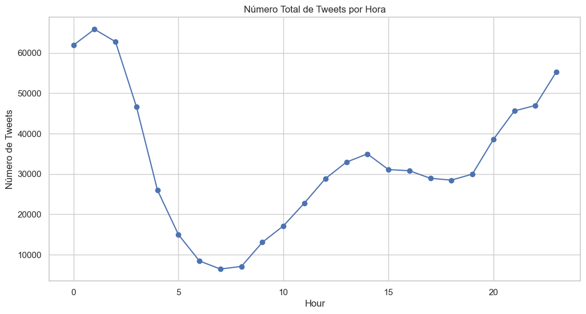

# 1. Resultados

## 1.1. Análisis General

Para empezar, se ha realizado un análisis del número de tweets por hora. Como se puede ver en el gráfico posterior, se publican más tweets durante la noche (periodo 7:00 am hasta 7:00 pm). Además, Las horas de mayor actividad parecen coincidir con la medianoche y la noche mientras que la horas de menos con la madrugada.

Por otro lado, se ha obtenido un gráfico en el que se puede apreciar claramente la poca cantidad de días lluviosos que existen en el dataset, coinciendo estos, además, con una nula cantidad de datos de tweets, dificultando enormemente el análisis.

## 1.2. Análisis de la condición meteorológica y el número de tweets en función del día y la noche

Para este análisis se han obtenido varios gráficos de lineas, realizando una marca visual en aquellos valores que correspondan según el gráfico.

### 1.2.1. Noche

Si hacemos un filtro eligiendo solo aquellos valores por encima de 3000 tweets obtenemos que hay 4 ocurriencias para dias *partly_cloudy_night* y solo 16 ocurrencias para dias *clear-night*.

### 1.2.2. Día

Si hacemos un filtro eligiendo solo aquellos valores por encima de 1900 tweets obtenemos que hay 14 ocurriencias para dias *partly_cloudy_day* y solo 5 ocurrencias para dias *clear-day*.

## 1.3. Análisis de Varianza (ANOVA)

Para este análisis se obtienen varios gráficos de la relación entre el estado del cielo y la cantidad de tweets publicados, incluyendo un análisis por separado del día y de la noche y otro análisis centrado en los sentimientos de dichos tweets.

Valor p del ANOVA: 0.19771467399421125

Valor p del ANOVA: 0.009878204388579717

Valor p del ANOVA: 0.09222475952389282

Valor p del ANOVA: 0.21878354371141961

Valor p del ANOVA: 0.04359749121404158

Valor p del ANOVA: 0.017766991798431123

## 1.4. Análisis de correlacion de variables (Temperatura y Número de Tweets)

Para empezar este análisis de correlación entre la temperatura y el número de tweets se obtiene tanto un gráfico mostrando la tendencia de la temperatura media a lo largo de las horas, como la cantidad de tweets publicada por hora.

### 1.4.1. Día

    
    

### 1.4.2. Noche

    
    

Posteriormente, se va a comprobar, más profundamente, si existe una relación entre la temperatura y los tweets.

Para este nuevo análisis se obtienen varios gráficos de la correlación entre la temperatura con los tweets, incluyendo un análisis por separado del día y de la noche y otro análisis centrado en los sentimientos de dichos tweets.

Correlación de Pearson: 0.21, p-valor: 3.927e-17

Correlación de Spearman: 0.26, p-valor: 1.759e-25

Correlación de Pearson: 0.37, p-valor: 1.989e-29

Correlación de Spearman: 0.32, p-valor: 1.578e-22

Correlación de Pearson: 0.33, p-valor: 1.113e-20

Correlación de Spearman: 0.34, p-valor: 6.243e-21

Correlación de Pearson: 0.32, p-valor: 8.833e-19

Correlación de Spearman: 0.32, p-valor: 6.301e-19

Correlación de Pearson: 0.02, p-valor: 6.1002e-01

Correlación de Spearman: 0.01, p-valor: 8.510e-01

## 1.5. Análisis de topics en día y noche con LDA

Para este análisis se ha utilizado el modelo **Latent Dirichlet Allocation (LDA)** para identificar los temas predominantes en los tweets durante el día y la noche. El modelo LDA permite descubrir temas ocultos en grandes volúmenes de texto, lo que es útil para entender mejor el contenido de los tweets en diferentes momentos del día.

Se han identificado los siguientes temas para los tweets nocturnos y diurnos:

### 1.5.1. Noche

- Topic  0  :
[ vou | ter | queria | pra | amor | vida | quero | ver | boa | dormir ]

- Topic  1  :
[ pra | queria | nao | tanto | vai | amo | vou | fazer | aqui | mano ]

- Topic  2  :
[ voc | agora | bem | pra | sim | triste | hoje | nada | assim | tudo ]

Log Likelihood:  -24736576.429696597

Perplexity:  4805.886813205813

### 1.5.2. Día

- Topic  0  :
[ pra | dia | bom | ter | vou | bem | vai | tudo | ver | aún ]

- Topic  1  :
[ sei | pra | queria | hacer | tanto | quedar | casa | nada | voy | buena ]

- Topic  2  :
[ quiero | est | voc | gente | vida | vel | rio | mejor | hace | todos ]

Log Likelihood:  -17235406.655189212

Perplexity:  5740.8264776089145

Estos resultados muestran los temas más comunes en los tweets durante el día y la noche, proporcionando una visión más profunda de las diferencias en el contenido de los tweets según la hora del día.

## 1.6. Modelo dinámico de tópicos por mes

En este análisis usamos modelo **Dynamic Topic Models**, que ofrece una evolución natural y suave y preserva la coherencia temporal, a diferencia de el modelo LDA anterior. Se usarán dos modelos con distintos hiperparámetros

### 1.6.1. Modelo 1

Se han identificado los siguientes temas con el **Modelo 1** para cada mes:

#### Mes 1

- Tópico 0: [('dia', 0.017401913681494595), ('pra', 0.017166979850785417), ('bom', 0.010489373272524128), ('vou', 0.009215204168965369), ('vai', 0.0077690861642834425)]

- Tópico 1: [('pra', 0.013974089030100677), ('dia', 0.008591413476480339), ('vou', 0.0078299061818954), ('bem', 0.007542347002789349), ('voc', 0.007028690620741008)]

- Tópico 2: [('voc', 0.027731912843179843), ('agora', 0.022113305538185857), ('algum', 0.018865467172670385), ('pra', 0.014040224087494899), ('falta', 0.01385832956770457)]

- Tópico 3: [('queria', 0.01970140266736145), ('pra', 0.019594308979480345), ('triste', 0.00848145140973452), ('vou', 0.007755112411400871), ('amo', 0.007321563595985502)]

- Tópico 4: [('pra', 0.01749406770746402), ('queria', 0.01738995818909345), ('amo', 0.014593781940868897), ('triste', 0.01093567287190327), ('vou', 0.00996650101699751)]

#### Mes 2

- Tópico 0: [('dia', 0.018086068517178235), ('pra', 0.0159399007516811), ('vou', 0.009335637756501407), ('bom', 0.009229748450254642), ('ter', 0.007321815470818806)]

- Tópico 1: [('pra', 0.013083686305304449), ('dia', 0.008491114005153042), ('vou', 0.007739384865799978), ('bem', 0.007173391878623308), ('voc', 0.0070958626636852306)]

- Tópico 2: [('pra', 0.019125860414155718), ('voc', 0.013361689353148135), ('vou', 0.010601474149345395), ('queria', 0.009259213448801708), ('vai', 0.008182697207610019)]

- Tópico 3: [('queria', 0.02379767043274388), ('pra', 0.019309484736273478), ('amo', 0.013584139774284982), ('tanto', 0.00870878489299365), ('triste', 0.008271350170965463)]

- Tópico 4: [('triste', 0.016822274391563852), ('pra', 0.01382425504174184), ('queria', 0.013544859349439114), ('gente', 0.00931417229964422), ('mano', 0.00826699585018071)]

#### Mes 3

- Tópico 0: [('pra', 0.01658505024549905), ('vai', 0.008670538357560396), ('dia', 0.007679285111543408), ('gente', 0.007307139124304893), ('voc', 0.007272745115138277)]

- Tópico 1: [('dia', 0.015791273848371465), ('pra', 0.014064914568726949), ('bom', 0.010820963691293917), ('vou', 0.007939123475114862), ('voc', 0.007116574699655431)]

- Tópico 2: [('pra', 0.021747409522150766), ('voc', 0.016629967312462097), ('vou', 0.012510907248326812), ('vai', 0.008913906089639798), ('bem', 0.008313325031340494)]

- Tópico 3: [('queria', 0.019837994727849844), ('pra', 0.01764923947552493), ('amo', 0.01160959091226515), ('triste', 0.01149056514472047), ('vai', 0.008074748348488118)]

- Tópico 4: [('queria', 0.01979013938576946), ('pra', 0.015596727536568801), ('quero', 0.012355563556264201), ('vou', 0.011032872180699439), ('triste', 0.009732077506106537)]

### 1.6.2. Modelo 2

Se han identificado los siguientes temas con el **Modelo 2** para cada mes:

#### Mes 1

- Tópico 0: [('voc', 0.018375606387247726), ('pra', 0.015375417017315086), ('agora', 0.014829092186621894), ('algum', 0.011931013612492533), ('queria', 0.011555562354374565)]

- Tópico 1: [('pra', 0.014722572868493029), ('dia', 0.010358009546740531), ('vou', 0.00817350830757225), ('bom', 0.00779253660727113), ('bem', 0.007659973716003927)]

- Tópico 2: [('queria', 0.018962516108715986), ('pra', 0.018685314619399495), ('amo', 0.011865164902086694), ('triste', 0.00987826440257631), ('vou', 0.009036192682600844)]

#### Mes 2:

- Tópico 0: [('pra', 0.01582914358630554), ('queria', 0.010255527541773949), ('triste', 0.009885441795367388), ('dia', 0.00969625237988384), ('vou', 0.008830680396939976)]

- Tópico 1: [('pra', 0.014157997012279332), ('dia', 0.009981484589289111), ('vou', 0.008357392438364175), ('voc', 0.0076701230004072056), ('bem', 0.007428696661278187)]

- Tópico 2: [('queria', 0.02128309230222781), ('pra', 0.018319975107579402), ('amo', 0.010704150293467867), ('triste', 0.009402516800593364), ('vou', 0.008272978153890555)]

#### Mes 3:

- Tópico 0: [('pra', 0.016294392220424832), ('dia', 0.01061671318429022), ('queria', 0.009298625309780666), ('triste', 0.00897820633409102), ('ter', 0.007517103353175356)]

- Tópico 1: [('pra', 0.015255132975154588), ('dia', 0.011756962721665385), ('voc', 0.00886745519985516), ('bom', 0.007856297877520154), ('vou', 0.007781777447066395)]

- Tópico 2: [('pra', 0.018392201194899118), ('queria', 0.01666051666776638), ('triste', 0.009490434551248284), ('amo', 0.009469548197934007), ('vou', 0.009006023495778248)]

## 1.7 Series temporales con variables exógenas

Para la variable del día y la noche p valor de 0.530. Para día de la semana p valor de 0.000. 

